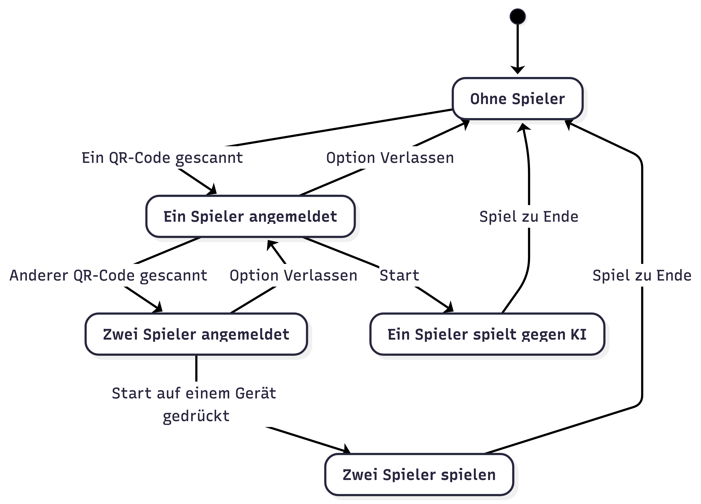

# Q3 Spiel Entwicklung Schaufenster

- [ ] Linux Rechner nach Neustart startet Spiel automatisch
- [ ] Umstellung auf RasPi Software testen
- [ ] Neue Anmeldelogik
  - [ ] Ohne Spieler läuft IdleModus, d.h. KI vs KI
  - [ ] Ein Spieler hat Option Single Game zu starten -> SinglePlayerModus; sonst WarteModus
        - [ ] TODO: Muss der WarteModus nach einem Timeout automatisch beendet werden?
    - [ ] Im SinglePlayerModus kann kein zweiter Spieler unterbrechen. Erst nach dem Ende geht es in den IdleModus
    - [ ] Zweiter Spieler meldet sich an: Spiel startet den PairGameModus. Kann nicht unterbrochen werden; geht am Ende in den IdleModus zurück
    - [ ] Ist das ein generell geeigneter Ablauf für Spiele, die allein und zu zweit gespielt werden können?
  


- [ ] Logging der Spiele (Uhrzeit, Dauer, …???)
- [ ] Spielbalance optimieren für alle drei Spielformen
- [ ] Paddels mit Farbe und Schraffur erkennbar machen - passend dazu Hintergrund / Start Button in Controller
- [ ] Spiel Schwerer machen mit der Zeit (Level?)
- [ ] Neue Spielideen:
  - [ ] Sammelspiel für Einzelspieler: Man steuert wie ein Paddle aber eine wechselnde Figur, die herabfallende Dinge sammeln und anderen ausweichen muss. Für “Gute” Sachen bekommet man Herzen, für “Schlechte” wird man schwächer und irgendwann endet die Runde.Die eigene Figur wechselt je nach Runde (oder einfach so) und man muss selbst überlegen, was für einen gut und was schlecht ist.In späteren Levels kommt evtl. Wind dazu, oder man fährt nicht einfach gerade sondern schräg oder auf welliger Ebene etc. oder durch bremsende Hindernisse / Bereiche wie Pfützen etc.
- [x] Remote Updates ermöglichen via ssh
- [x] Was passiert wenn man einfach weggeht, die Verbindung zu einem Controller abbricht? Dann sollte der Spieler wieder frei sein und KI gesteuert.
- [x] Start vereinfachen. Keine Start-Stoptaste. Einfach nur Scannen
- [x] Tunnel auf Linux installieren
- [x] Git holen auf Linux
- [x] TurboWarp auf Linux installieren
- [x] Ergebnis zelebrieren
- [x] Nachts leiser
- [x] Sounds bei Punkt
- [x] Testen und Spielbalance
- [x] Installation
- [x] QR Codes in Start Zustand einblenden
- [x] Erstes Tuning Spielbalance KI
- [x] Ein- und Zweispielermodus???
- [x] Anpassungen machen
- [x] Auflösung auf 720 x 1280 Hochformat stellen
- [x] Steuerung testen
- [x] Idee entwickeln
- [x] Pong in TurboWarp importieren 

## Ablauf Start

- [ ] Können wir jedes Paddle einzeln einem Spieler zuweisen und dann gegen Neuzuweisung blocken?
- [ ] Paddle ist idle, dann spielt KI
- [ ] Wenn niemand da spielt die KI gegen sich selbst. Dazu werden Di QR Codes eingeblendet
- [ ] Wenn ein QR Code gescannt wird und sich ein Spieler dort am Paddle anmeldet, beginnt eine kurze Start-Phase, in der ein zweiter Spieler sich an das freie Paddle anmelden kann. 
- [ ] Wenn sich zwei Spieler angemeldet haben startet das Spiel der beiden geheneinander. 
- [ ] Wenn die Start-Phase abgelaufen ist und sich nur ein Spieler angemeldetbhat startet das Spie einer gegen die KI.
- [ ] Wenn das Spiel zu Ende ist, wird das Ergebnis angezeigt und die Spieler werden abgemeldet. wir kommen wieder in die Idle-Phase. Die KI beginnt gegen sich selbst zu spielen.

## Zustände und Übergänge

- [ ] Idle: KI spielt gegen sich selbst. Zwei QR Codes werden angezeigt, mit dem Hinweis, dass man sich damit als Spieler anmelden kann.
  - [ ] Wenn ein Spieler einen QR Code scannt wird der Controller geladen und gestartet. Dabei versucht sich der Controller beim Server als Spieler anzumelden.
        - [ ] Wenn dieser betreffende Spieler (z. Bsp. Paddle) noch frei ist: 
            - [ ] belegt der Controller diesen Spieler auf dem Server
            - [ ] zeigt den Nutzer im Controller an, welchen Spieler er belegt hat und zeigt an, dass die Startvorbereitungen im Gange sind —> Zustandswechsel zu “Start”
        - [ ] Sonst zeigt der Controller an, dass dieser Spieler schon belegt ist.
- [ ] Start:
  - [ ] der Controller zeigt an, dass die Startphase läuft und mit welchem Spieler man assoziiert ist (Paddle).
    - [ ] der Server hat einen von zwei Spielern belegt. Der andere ist noch frei
    - [ ] sobald der zweite Spieler auch belegt wurde, erfolgt Zustandswechsel auf “Spiel”
    - [ ] falls der eine Spieler sich abmeldet, erfolgt Zustandswechsel zu “Idle”
- [ ] Spiel:
  - [ ] (Optional wird ein Countdown angezeigt auf dem Screen und an den Controllern)
    - [ ] Zu Beginn startet der Spielablauf (der separat definiert wird). Die beiden Controller sind mit je einem Spieler verbunden und steuern diesen kontinuierlich. 
    - [ ] Änderungen des Spielzustands werden ggf. den Controllern mitgeteilt. 
    - [ ] Die Controller kommunizieren Eingaben der Nutzer kontinuierlich an den Spielserver.
    - [ ] Wenn das Spiel zu Ende ist, wird in den Zustand “Ende” gewechselt.
- [ ] Ende:
  - [ ] Den Controllern wird ggf. das Ergebnis des Spiels mitgeteilt.


# Remote-Zugriff auf den Produktivrechner (Linux) via Tailscale

Dieses Dokument beschreibt, wie ich mich von meinem **Entwicklungsrechner (Mac)** aus
mit dem **Produktivrechner (Linux)** verbinde – unabhängig vom WLAN oder Standort.

---

## Voraussetzungen

- Tailscale-Account (z. B. Google / GitHub Login)
- Tailscale ist **auf beiden Rechnern installiert**
- Auf dem Linux-Rechner habe ich einen Benutzer (z. B. `ich`)

---

## 1. Tailscale auf dem Mac starten

### 1.1 Prüfen, ob Tailscale läuft
```bash
ps aux | grep tailscaled | grep -v grep
```

Wenn **keine Ausgabe** erscheint → Dienst läuft nicht.

---

### 1.2 Tailscale-Dienst manuell starten
```bash
sudo /opt/homebrew/opt/tailscale/bin/tailscaled
```

- Dieses Terminal **offen lassen**
- Meldungen wie `logtail started` sind normal
- TPM-Warnungen auf macOS können ignoriert werden

---

### 1.3 Tailscale aktivieren (neues Terminal-Fenster)
```bash
sudo tailscale up --ssh
```

- Es öffnet sich ein Browser (oder du machst das amnuell mit der angezeigten URL)
- Mit deinem Tailscale-Account einloggen (Hier via Git mit Q3GitTeam als User)
- Danach ist der Mac im Tailnet

---

### 1.4 Status prüfen
```bash
tailscale status
```

Der Produktivrechner (Linux) sollte hier erscheinen.

---

## 2. Verbindung zum Linux-Rechner herstellen

### 2.1 Per SSH (empfohlen)
```bash
ssh ich@<hostname-des-linux-rechners>
```

z. B.
```bash
ssh ich@projektlapiU111
```

Alternativ mit IP:
```bash
ssh ich@100.x.y.z
```

---

## 3. Tailscale auf dem Linux-Rechner (einmalig)

Auf dem Linux-Rechner sicherstellen:

```bash
sudo systemctl enable --now tailscaled
sudo tailscale up --ssh
```

Danach läuft Tailscale automatisch beim Start.

---

## 4. Typische Probleme & Lösungen

### ❌ `tailscale up` sagt: „failed to connect to local Tailscale service“
→ `tailscaled` läuft nicht  
→ Schritt **1.2** ausführen

---

### ❌ SSH geht nicht, obwohl Tailscale online ist
→ SSH-Funktion nicht aktiviert  
```bash
sudo tailscale up --ssh
```

---

## 5. Zielzustand

Wenn alles korrekt läuft:

- `tailscale status` zeigt **Mac + Linux**
- SSH funktioniert 